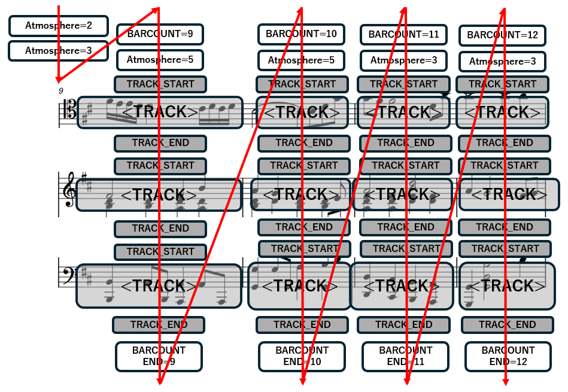

# 研究
マルチトラック楽曲譜面の自動生成モデル 
数小節を条件に、後に続く楽曲部分を生成 

## 改良点
１．MMMのトークンに楽曲の雰囲気を表現するAtmosphereトークンの追加 
　⇒楽曲の全体構造を認識可能に 
 
２．オーバーラップ学習 
　⇒2小節を被せて学習を行うことで逐次的に次の2小節を生成可能 

## トークン化方法

矢印の順にトークンを一列に並べていく 

## Atmosphere
楽曲の信号ファイルにクラスタリングを行うことで、単一楽曲内をいくつかに分類している(Aメロ、サビのように) 
楽曲間のクラスタリングも行っているため、雰囲気の近い楽曲同士は同じAtmosphereが割り振られる 
